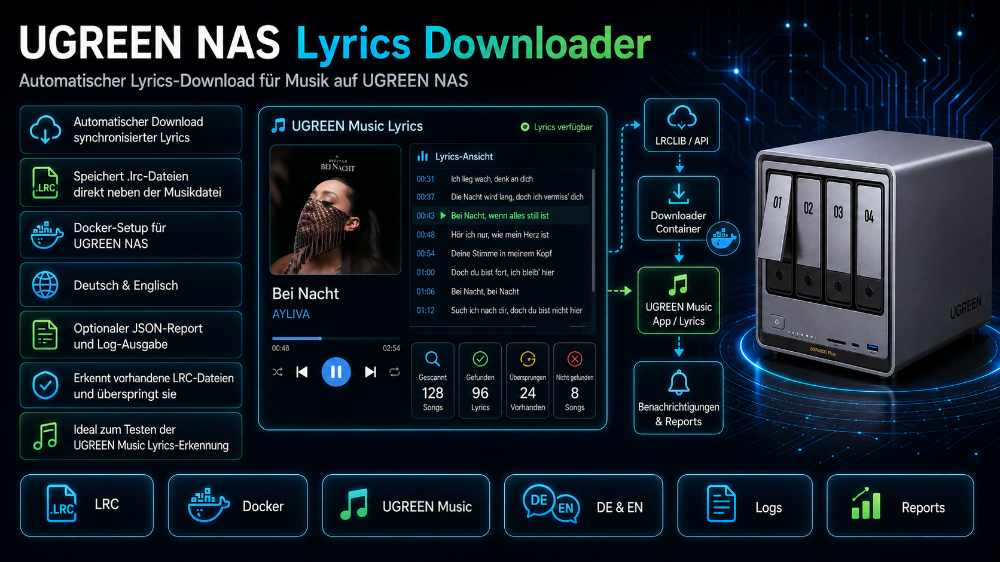

# UGREEN NAS Lyrics Downloader



Der **UGREEN NAS Lyrics Downloader** ist ein leichtgewichtiges Docker-Paket für UGREEN NAS Systeme mit UGOS. Das Tool durchsucht eine Musikbibliothek automatisch nach Audiodateien, lädt passende Lyrics über LRCLIB herunter und speichert synchronisierte `.lrc`-Dateien direkt neben den Musikdateien.

Das Paket ist besonders dafür gedacht, die Lyrics-Erkennung der UGREEN Music App zu testen. Es funktioniert grundsätzlich auch auf anderen Docker-Hosts, ist aber für die Nutzung auf UGREEN NAS mit der Docker App vorbereitet.

## Features

- Automatischer Download synchronisierter Lyrics
- Speicherung als `.lrc`-Datei direkt neben der jeweiligen Musikdatei
- Docker-Setup für UGREEN NAS und UGOS
- Deutsch und Englisch in Konfiguration und Dokumentation
- Optionaler JSON-Report unter `reports/last_report.json`
- Log-Ausgabe direkt im Docker-Protokoll
- Erkennt vorhandene `.lrc`-Dateien und überspringt sie
- Optionaler Dry-Run ohne Dateischreibzugriff
- Geeignet zum Testen der UGREEN Music Lyrics-Erkennung

## Projektstruktur

```text
UGREEN-NAS-Lyrics-Downloader/
|- README.md
|- Dockerfile
|- docker-compose.yaml
|- requirements.txt
|- .env
|- Screens/
|  `- Lyrics_Downloader.png
|- app/
|  `- lyrics_downloader.py
|- config/
`- reports/
```

## Schnellstart auf einem UGREEN NAS mit Docker App

1. Paket herunterladen und entpacken.
2. Den entpackten Ordner auf das NAS kopieren, zum Beispiel nach:

```text
/volume2/docker/UGREEN-NAS-Lyrics-Downloader
```

3. Die Datei `.env` öffnen und die wichtigsten Werte anpassen:

```env
HOST_MUSIC_DIR=/volume1/Emby/Musik
PUID=1009
PGID=10
```

4. In UGOS die **Docker App** öffnen.
5. Links auf **Projekt** klicken.
6. Ein neues Projekt erstellen.
7. Als Speicherpfad den Ordner des Pakets auswählen.
8. Die vorhandene Compose-Konfiguration importieren oder den Inhalt von `docker-compose.yaml` einfügen.
9. Auf **Bereitstellen** klicken.
10. Danach im Projekt unter **Protokoll** prüfen, ob Lyrics gefunden und geschrieben werden.

## Beispiel `.env`

```env
HOST_MUSIC_DIR=/volume1/Emby/Musik
PUID=1009
PGID=10
SCAN_INTERVAL_SECONDS=0
AUDIO_EXTENSIONS=.mp3,.flac,.m4a,.mp4,.ogg,.opus
REQUIRE_SYNCED_LYRICS=true
WRITE_PLAIN_AS_LRC=false
WRITE_SIDECAR_LRC=true
WRITE_EMBEDDED_TAGS=false
SKIP_EXISTING_LRC=true
TOUCH_AUDIO_ON_WRITE=true
DRY_RUN=false
REQUEST_DELAY_SECONDS=1.0
MAX_FILES_PER_RUN=0
SAVE_REPORT=true
REPORT_PATH=/reports/last_report.json
LOG_LEVEL=INFO
USER_AGENT=UGREEN-NAS-Lyrics-Downloader/1.0
```

## Wichtige Einstellungen

| Variable | Beispiel | Bedeutung |
|---|---:|---|
| `HOST_MUSIC_DIR` | `/volume1/Emby/Musik` | Host-Pfad zur Musikbibliothek auf dem NAS |
| `PUID` | `1000` | Benutzer-ID für Dateizugriff |
| `PGID` | `10` | Gruppen-ID für Dateizugriff |
| `SCAN_INTERVAL_SECONDS` | `0` | `0` bedeutet einmal ausführen und beenden, `86400` bedeutet einmal täglich im Container laufen lassen |
| `REQUIRE_SYNCED_LYRICS` | `true` | Nur synchronisierte Lyrics verwenden |
| `WRITE_PLAIN_AS_LRC` | `false` | Unsynchronisierte Lyrics als einfache LRC-Datei schreiben, wenn keine synchronisierten Lyrics gefunden werden |
| `WRITE_SIDECAR_LRC` | `true` | `.lrc`-Datei neben der Audiodatei speichern |
| `WRITE_EMBEDDED_TAGS` | `false` | Lyrics zusätzlich in Audiodatei-Tags schreiben |
| `SKIP_EXISTING_LRC` | `true` | Vorhandene `.lrc`-Dateien nicht überschreiben |
| `TOUCH_AUDIO_ON_WRITE` | `true` | Audiodatei nach erfolgreichem Schreiben kurz anfassen, damit Änderungen eher erkannt werden |
| `DRY_RUN` | `false` | Testlauf ohne Dateischreibzugriff |
| `MAX_FILES_PER_RUN` | `0` | Maximale Dateien pro Lauf, `0` bedeutet keine Begrenzung |
| `SAVE_REPORT` | `true` | JSON-Report speichern |

## Docker Compose

Die mitgelieferte `docker-compose.yaml` ist für die Nutzung als UGOS Docker-Projekt vorbereitet:

```yaml
services:
  ugreen_lyrics_downloader:
    build:
      context: .
    image: ugreen-nas-lyrics-downloader:1.0.0
    container_name: ugreen_lyrics_downloader
    user: "${PUID:-1000}:${PGID:-10}"
    env_file:
      - .env
    volumes:
      - ./app:/app:ro
      - ${HOST_MUSIC_DIR:-/volume1/Emby/Musik}:/music
      - ./config:/config
      - ./reports:/reports
    restart: "no"
```

## Start per SSH oder Terminal

Alternativ kann das Paket auch per SSH gestartet werden:

```bash
cd /volume2/docker/UGREEN-NAS-Lyrics-Downloader
docker compose up --build
```

Wenn der Container dauerhaft laufen und in einem Intervall scannen soll, kann in der `.env` zum Beispiel gesetzt werden:

```env
SCAN_INTERVAL_SECONDS=86400
```

Dann kann der Container im Hintergrund gestartet werden:

```bash
docker compose up -d --build
```

## Log prüfen

Während oder nach dem Lauf kann das Docker-Protokoll geprüft werden:

```bash
docker compose logs -f
```

Typische Meldungen:

```text
INFO UGREEN NAS Lyrics Downloader 1.0.0 gestartet
INFO Musikordner: /music
INFO Suche Lyrics: Artist - Title
INFO WRITTEN: /music/Song.mp3 - Synchronisierte LRC geschrieben
INFO SKIPPED: /music/Song.mp3 - LRC existiert bereits
INFO NOT_FOUND: /music/Song.mp3 - Keine Lyrics bei LRCLIB gefunden
```

## Ergebnis prüfen

Nach dem Lauf sollten `.lrc`-Dateien neben den Audiodateien liegen:

```bash
find /volume1/Emby/Musik -type f -name "*.lrc" | head -50
```

Beispiel:

```text
/volume1/Emby/Musik/Single Jahrescharts 2023/79. AYLIVA - Bei Nacht.lrc
```

## Reports

Wenn `SAVE_REPORT=true` gesetzt ist, wird ein JSON-Report erstellt:

```text
reports/last_report.json
```

Der Report enthält eine Übersicht über gescannte Dateien, geschriebene Lyrics, übersprungene Dateien und nicht gefundene Einträge.

## Hinweise zur UGREEN Music App

Nach dem Erstellen der `.lrc`-Dateien kann es notwendig sein, die Mediathek in der UGREEN Music App neu einlesen zu lassen oder die App neu zu starten. Das Paket schreibt die Lyrics-Dateien in einem Standardformat direkt neben die Musikdateien. Ob und wann diese in der UGREEN Music App angezeigt werden, hängt von der Erkennung und Indexierung der App ab.

## Unterstützte Audioformate

Standardmäßig werden folgende Erweiterungen verarbeitet:

```text
.mp3, .flac, .m4a, .mp4, .ogg, .opus
```

Die Liste kann über `AUDIO_EXTENSIONS` in der `.env` angepasst werden.

## Lizenz und Nutzung

Dieses Projekt steht unter der **PolyForm Noncommercial License 1.0.0**.

- Nichtkommerzielle Nutzung ist erlaubt
- Kommerzielle Nutzung ist nicht erlaubt
- Für kommerzielle Nutzung ist vorab eine schriftliche Genehmigung des Autors erforderlich

Bei Interesse an einer kommerziellen Nutzung kontaktiere mich bitte vorab.

## Dokumentation

Das ausführliche deutsch-englische Handbuch liegt separat als DOCX/PDF im Release-Paket bei.

## Version

- Lyrics Downloader Version: **V1.0.0**
- Build-Stand im Paket: **2026-05-19.1**

## English note

The **UGREEN NAS Lyrics Downloader** is a lightweight Docker package for UGREEN NAS systems running UGOS. It scans a music library, downloads matching lyrics from LRCLIB and stores synchronized `.lrc` files next to the audio files.

This project is intended to help test lyrics detection in the UGREEN Music app. Runtime settings are configured through `.env`, and the package can be deployed through the UGREEN Docker App or with Docker Compose.

This project is licensed under the **PolyForm Noncommercial License 1.0.0**.

- Noncommercial use is allowed
- Commercial use is not allowed
- Commercial use requires prior written permission from the author

## Copyright

Copyright (c) 2026 Roman Glos
