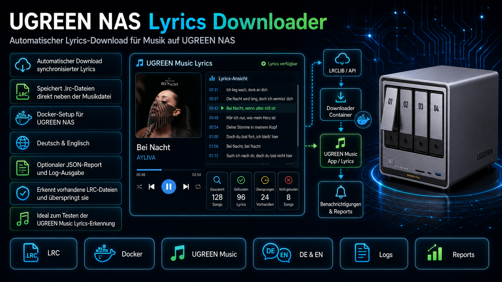

# UGREEN NAS Lyrics Downloader

[](https://github.com/Railsimulatornet/UGREEN-NAS-Lyrics-Downloader/actions/workflows/docker-publish.yml)
[](https://github.com/Railsimulatornet/UGREEN-NAS-Lyrics-Downloader/actions/workflows/security-scan.yml)
[](LICENSE)



Der **UGREEN NAS Lyrics Downloader** ist ein leichtgewichtiges Docker-Paket für UGREEN NAS Systeme mit UGOS. Das Tool durchsucht eine Musikbibliothek automatisch nach Audiodateien, lädt passende Lyrics über LRCLIB herunter und speichert synchronisierte `.lrc`-Dateien direkt neben den Musikdateien.

Das Paket ist besonders dafür gedacht, die Lyrics-Erkennung der UGREEN Music App zu testen. Es funktioniert grundsätzlich auch auf anderen Docker-Hosts, ist aber für die Nutzung auf UGREEN NAS mit der Docker App vorbereitet.

## Features

- Automatischer Download synchronisierter Lyrics
- Speicherung als `.lrc`-Datei direkt neben der jeweiligen Musikdatei
- Docker-Setup für UGREEN NAS und UGOS
- Deutsch und Englisch in Konfiguration und Dokumentation
- Optionaler JSON-Report unter `reports/last_report.json`
- Log-Ausgabe direkt im Docker-Protokoll
- Erkennt vorhandene `.lrc`-Dateien und überspringt sie
- Optionaler Dry-Run ohne Dateischreibzugriff
- Geeignet zum Testen der UGREEN Music Lyrics-Erkennung

## Projektstruktur

```text
UGREEN-NAS-Lyrics-Downloader/
|- README.md
|- Dockerfile
|- docker-compose.yaml
|- requirements.txt
|- .env
|- Screens/
|  `- Lyrics_Downloader.png
|- app/
|  `- lyrics_downloader.py
|- config/
`- reports/
```

## Schnellstart auf einem UGREEN NAS mit Docker App

1. Paket herunterladen und entpacken.
2. Den entpackten Ordner auf das NAS kopieren, zum Beispiel nach:

```text
/volume2/docker/UGREEN-NAS-Lyrics-Downloader
```

3. Die Datei `.env` öffnen und die wichtigsten Werte anpassen:

```env
HOST_MUSIC_DIR=/volume1/Emby/Musik
PUID=1009
PGID=10
```

4. In UGOS die **Docker App** öffnen.
5. Links auf **Projekt** klicken.
6. Ein neues Projekt erstellen.
7. Als Speicherpfad den Ordner des Pakets auswählen.
8. Die vorhandene Compose-Konfiguration importieren oder den Inhalt von `docker-compose.yaml` einfügen.
9. Auf **Bereitstellen** klicken.
10. Danach im Projekt unter **Protokoll** prüfen, ob Lyrics gefunden und geschrieben werden.

## Beispiel `.env`

```env
HOST_MUSIC_DIR=/volume1/Emby/Musik
PUID=1009
PGID=10
SCAN_INTERVAL_SECONDS=0
AUDIO_EXTENSIONS=.mp3,.flac,.m4a,.mp4,.ogg,.opus
REQUIRE_SYNCED_LYRICS=true
WRITE_PLAIN_AS_LRC=false
WRITE_SIDECAR_LRC=true
WRITE_EMBEDDED_TAGS=false
SKIP_EXISTING_LRC=true
TOUCH_AUDIO_ON_WRITE=true
DRY_RUN=false
REQUEST_DELAY_SECONDS=1.0
MAX_FILES_PER_RUN=0
SAVE_REPORT=true
REPORT_PATH=/reports/last_report.json
LOG_LEVEL=INFO
USER_AGENT=UGREEN-NAS-Lyrics-Downloader/1.0.2
```

## Wichtige Einstellungen

| Variable | Beispiel | Bedeutung |
|---|---:|---|
| `HOST_MUSIC_DIR` | `/volume1/Emby/Musik` | Host-Pfad zur Musikbibliothek auf dem NAS |
| `PUID` | `1000` | Benutzer-ID für Dateizugriff |
| `PGID` | `10` | Gruppen-ID für Dateizugriff |
| `SCAN_INTERVAL_SECONDS` | `0` | `0` bedeutet einmal ausführen und beenden, `86400` bedeutet einmal täglich im Container laufen lassen |
| `REQUIRE_SYNCED_LYRICS` | `true` | Nur synchronisierte Lyrics verwenden |
| `WRITE_PLAIN_AS_LRC` | `false` | Unsynchronisierte Lyrics als einfache LRC-Datei schreiben, wenn keine synchronisierten Lyrics gefunden werden |
| `WRITE_SIDECAR_LRC` | `true` | `.lrc`-Datei neben der Audiodatei speichern |
| `WRITE_EMBEDDED_TAGS` | `false` | Lyrics zusätzlich in Audiodatei-Tags schreiben |
| `SKIP_EXISTING_LRC` | `true` | Vorhandene `.lrc`-Dateien nicht überschreiben |
| `TOUCH_AUDIO_ON_WRITE` | `true` | Audiodatei nach erfolgreichem Schreiben kurz anfassen, damit Änderungen eher erkannt werden |
| `DRY_RUN` | `false` | Testlauf ohne Dateischreibzugriff |
| `MAX_FILES_PER_RUN` | `0` | Maximale Dateien pro Lauf, `0` bedeutet keine Begrenzung |
| `SAVE_REPORT` | `true` | JSON-Report speichern |

## Docker Compose

Die mitgelieferte `docker-compose.yaml` ist weiterhin für den **lokalen Build** als UGOS Docker-Projekt vorbereitet:

```yaml
services:
  ugreen_lyrics_downloader:
    build:
      context: .
      args:
        VERSION: "1.0.2"
    image: ugreen-nas-lyrics-downloader:1.0.2
    container_name: ugreen_lyrics_downloader
    user: "${PUID:-1000}:${PGID:-10}"
    env_file:
      - .env
    volumes:
      - ${HOST_MUSIC_DIR:-/volume1/Emby/Musik}:/music
      - ./config:/config
      - ./reports:/reports
    restart: "no"
```

Der Anwendungscode wird direkt aus dem gebauten Image ausgeführt. Dadurch bleibt die im Image enthaltene Versions- und Runtime-Umgebung konsistent.

## Start per SSH oder Terminal

Alternativ kann das Paket auch per SSH gestartet werden. **Bei bestehenden UGOS-Projekten den tatsächlichen Projektnamen aus dem Container-Label `com.docker.compose.project` verwenden.** Der Name `lyrics_downloader` in den folgenden Beispielen ist für eine Neuinstallation gedacht; nicht aus dem Ordnernamen ableiten.

```bash
cd /volume2/docker/UGREEN-NAS-Lyrics-Downloader
docker compose -p lyrics_downloader up --build
```

Wenn der Container dauerhaft laufen und in einem Intervall scannen soll, kann in der `.env` zum Beispiel gesetzt werden:

```env
SCAN_INTERVAL_SECONDS=86400
```

Dann kann der Container im Hintergrund gestartet werden:

```bash
docker compose -p lyrics_downloader up -d --build
```

## Log prüfen

Während oder nach dem Lauf kann das Docker-Protokoll geprüft werden:

```bash
docker compose -p lyrics_downloader logs -f
```

Typische Meldungen:

```text
INFO UGREEN NAS Lyrics Downloader 1.0.2 gestartet
INFO Musikordner: /music
INFO Suche Lyrics: Artist - Title
INFO WRITTEN: /music/Song.mp3 - Synchronisierte LRC geschrieben
INFO SKIPPED: /music/Song.mp3 - LRC existiert bereits
INFO NOT_FOUND: /music/Song.mp3 - Keine Lyrics bei LRCLIB gefunden
```

## Ergebnis prüfen

Nach dem Lauf sollten `.lrc`-Dateien neben den Audiodateien liegen:

```bash
find /volume1/Emby/Musik -type f -name "*.lrc" | head -50
```

Beispiel:

```text
/volume1/Emby/Musik/Single Jahrescharts 2023/79. AYLIVA - Bei Nacht.lrc
```

## Reports

Wenn `SAVE_REPORT=true` gesetzt ist, wird ein JSON-Report erstellt:

```text
reports/last_report.json
```

Der Report enthält eine Übersicht über gescannte Dateien, geschriebene Lyrics, übersprungene Dateien und nicht gefundene Einträge.

## Hinweise zur UGREEN Music App

Nach dem Erstellen der `.lrc`-Dateien kann es notwendig sein, die Mediathek in der UGREEN Music App neu einlesen zu lassen oder die App neu zu starten. Das Paket schreibt die Lyrics-Dateien in einem Standardformat direkt neben die Musikdateien. Ob und wann diese in der UGREEN Music App angezeigt werden, hängt von der Erkennung und Indexierung der App ab.

## Unterstützte Audioformate

Standardmäßig werden folgende Erweiterungen verarbeitet:

```text
.mp3, .flac, .m4a, .mp4, .ogg, .opus
```

Die Liste kann über `AUDIO_EXTENSIONS` in der `.env` angepasst werden.

## Vorgebaute Images und Wartung

Die Image-Namen bleiben `railsimulatornet/ugreen-nas-lyrics-downloader` auf Docker Hub und `ghcr.io/railsimulatornet/ugreen-nas-lyrics-downloader` auf GHCR. Beide Quellen bieten AMD64 und ARM64.

- `1.0.2`: feste Release-Version, die bei späteren Wartungsbuilds nicht überschrieben wird.
- `latest`: aktueller geprüfter Build; wird zusätzlich wöchentlich frisch gebaut.
- `1.0.2-build.20260927.10.1`: Beispiel für einen Wartungsbuild mit Version, Datum und Buildnummer.

Ein frischer Build wird für beide Architekturen geprüft und ohne weiteren Build in beiden Registries veröffentlicht. Behebbare schwere oder kritische Funde und Scanfehler verhindern die Veröffentlichung. Der vollständige Scanbericht enthält auch noch nicht behebbare Funde.

**Bestehende lokale Installationen:** Die neue `Dockerfile` und `requirements.txt` übernehmen, Versionsangaben im eigenen Compose-Projekt auf `1.0.2` anpassen und den bestehenden Lyrics-Downloader-Dienst neu bauen. Die eigene `.env`, angepasste Mounts, Musik und `.lrc`-Dateien nicht überschreiben. Die mitgelieferte Compose-Datei wird nicht automatisch auf ein Registry-Image umgestellt.

## Lizenz

Dieses Projekt steht unter der **MIT License**.

## Dokumentation

Das ausführliche deutsch-englische Handbuch liegt als PDF im Repository beziehungsweise Release-Paket bei. Für v1.0.2 wird das zuletzt veröffentlichte DE/EN-Handbuch aus v1.0.1 unverändert mitgeliefert; die aktuellen Update-Hinweise stehen hier und in den Release Notes.

## Version

- Lyrics Downloader Version: **V1.0.2**
- Build-Stand im Paket: **2026-09-27.1**

## English note

The **UGREEN NAS Lyrics Downloader** is a lightweight Docker package for UGREEN NAS systems running UGOS. It scans a music library, downloads matching lyrics from LRCLIB and stores synchronized `.lrc` files next to the audio files.

The included Compose project still builds locally. Prebuilt AMD64 and ARM64 images remain available from Docker Hub and GHCR under the existing names. Fixed release tags are preserved; `latest` receives checked weekly rebuilds. Existing installations must retain their `.env`, customized mounts, music and `.lrc` files. For local updates, replace `Dockerfile` and `requirements.txt`, update the version entries, and rebuild the existing service using its actual Compose project name.
